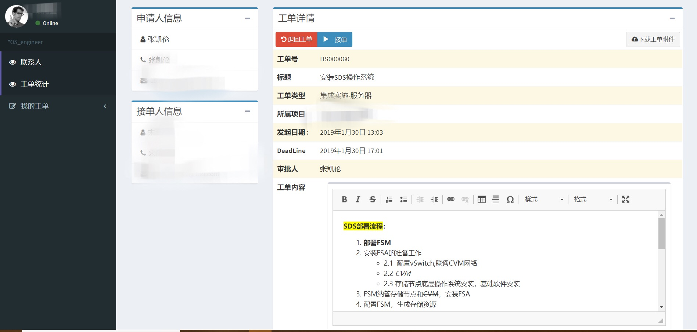

# Integration CMDB

## OverView
* [Development Document](#development-document)
* [Getting Start](#getting-start)
* [Features](#features)
* [Version & Plan](#version)
* [Contributors](#contributors)

## Development Document
### Architecture
* Event Ralationship Diagram  
  

* Instruction of data tables

table | instruction
---|---
assets_asset                      |	#资产共有字段表
assets_cabletablefille            | #布线表excel文件索引
assets_descfile                   | #端口描述配置文件索引
assets_locate                     | #机柜位置表
assets_networkdevice              | #网络设备表
assets_port                       | #设备端口表
assets_project                    | #项目表
assets_server                     | #服务器设备表
assets_stordevice                 | #存储设备表
auth_group                        | #django默认的自动分组
auth_group_permissions            | #django默认的组权限
auth_permission                   | #django权限表
cableTable_asset                  | #未录入资产表
cableTable_cabletablefille        | #未录入布线表excel文件索引
cableTable_locate                 | #未录入机柜位置表
cableTable_networkdevice    	  | #未录入网络设备表
cableTable_port                  | #未录入设备端口表
cableTable_project               | #未录入项目表
cableTable_server                | #未录入服务器设备表
cableTable_stordevice            | #未录入存储设备表
django_admin_log                 | #admin用户操作记录
django_content_type              | #django模型
django_migrations                | #数据库变更操作记录
django_session                   | #session信息记录(新增权限会写入session中)
myAuth_role                      | #ICMDB用户角色表
myAuth_userinfo                  | #ICMDB用户信息表
myAuth_userinfo_groups           | #ICMDB用户组信息表
myAuth_userinfo_role             | #ICMDB用户与角色表对应关系表
myAuth_userinfo_user_permissions | #用户表与权限对应关系表
workOrder_workorder              | #工单表（同一工单号，不同工单状态，为多条记录）
workOrder_workordernum           | #唯一工单表（同一工单号只有1条记录）


## Getting Start
* OS：CentOS 7.X
* Python：Python >= 3.6
* Module：  
    > Django >= 2.0.0    
    > openpyxl >= 2.5.12  
    > ansible  
    > ansible-cmdb  
    > nmap  

#### Execute python code after installation
```
from myAuth.models import UserInfo

UserInfo.objects.create_user(username='zhangkl',password='1qaz@WSX',last_name='zhang',first_name='Clay',
email='clay.zhang@outlook.com',telephone='15967188037',department='网络组',position='devops')
```

#### Login user and password
* user: admin
* password: 1qaz@WSX

## Features
#### Introduction to functional modules
```
Assets：资产管理系统模块
CableTable：线缆布放表审核模块
Contact：联系人模块
Dashboard：项目展示界面模块
MyAuth: ICMDB用户权限控制模块
Sysetting：系统基础设置模块
WorkOrder: 工单系统模块
ParentView: 装饰器集合
Media: 动态文件目录
Static: 静态文件目录
Templates: 前端页面使用模版文件
Util：后端模块工具集合
```
### Project screenshots

* Configuration Management of Assets 
  
  
  

* Approve Cable tables  
  
  
  

* WorkOrder Module  
  
  
  
  
  

## Version & Plan
### Version
#### Current Version
- [1.3.0]
	- 新加的功能
		1. 资产存活检测
		2. 基于ansible-cmdb的资产详情库


### Plan
- [x] 带项目文件管理的工单系统
- [x] 项目管理系统（展示、进度管理、资源管理）
- [x] 基于ansible-cmdb的资产详情库
- [ ] 带权限与操作日志记录的操作平台
- [x] 协助规划设计相关功能
- [x] 网络自动化配置集成功能
- [ ] PXE安装各位操作系统UI平台
- [ ] 基于ansible的OS层面批量操作UI界面
- [ ] VMWare虚拟化批量操作（创建VM、迁移等）UI界面
- [ ] 集成阶段CMDB，协助入网信息自动化采集交付

## Contributors
> Clay  
> Email: clay.zhang@outlook.com


